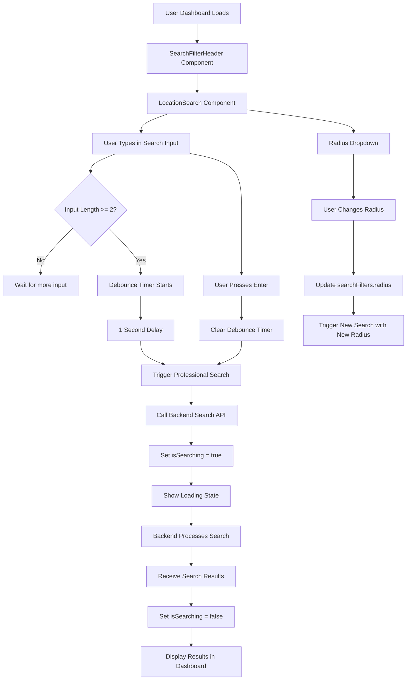
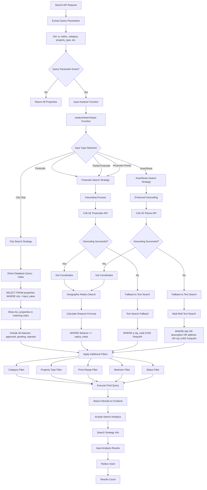
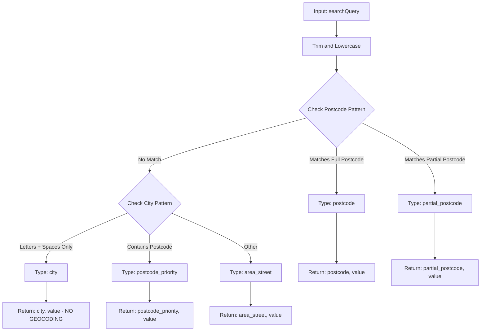
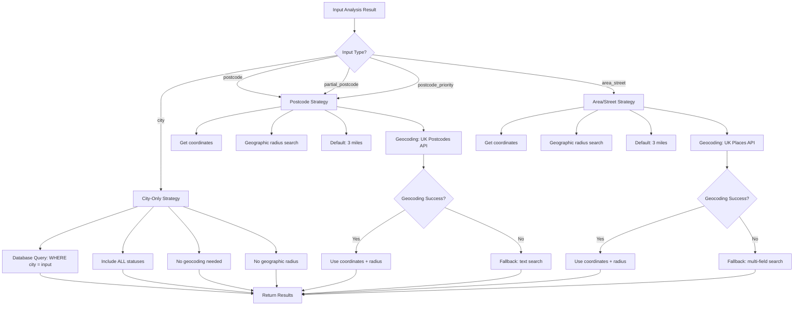
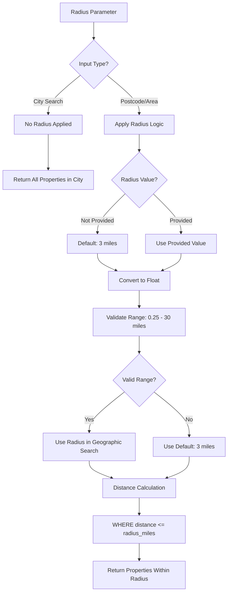
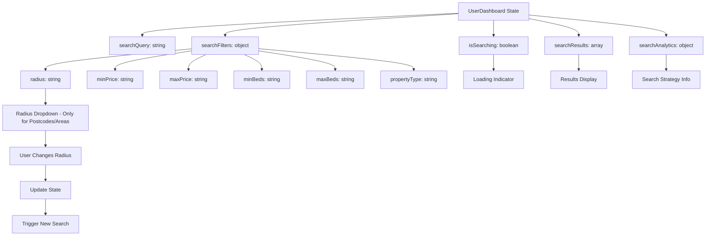
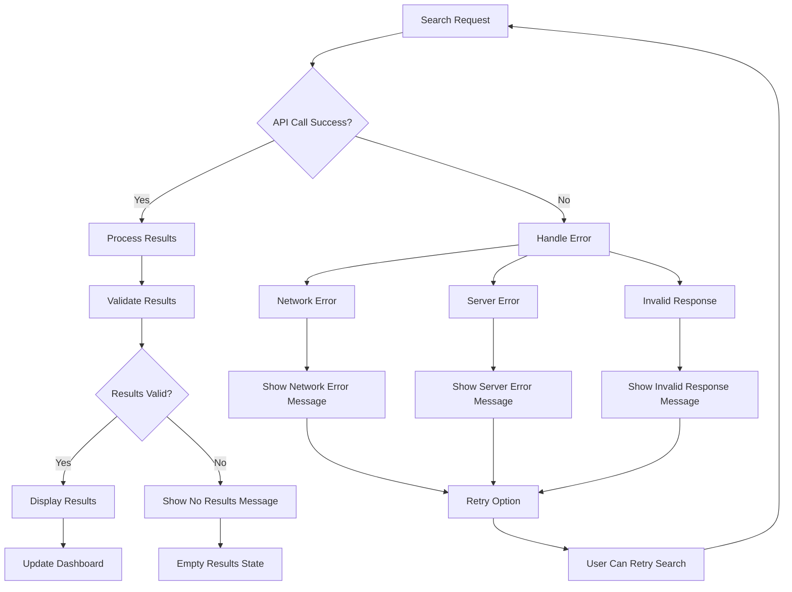
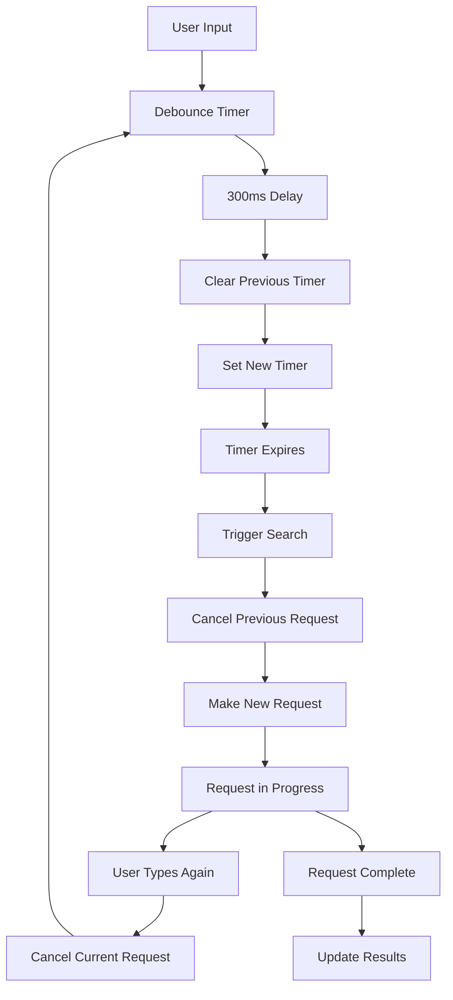
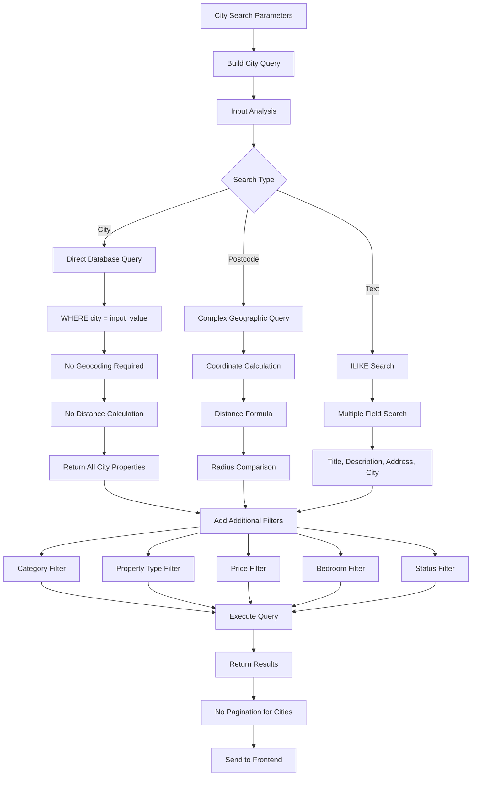

# Professional Search Header & Location Search Strategy Flowchart

## Overview
This document outlines the complete flow for the professional search header and location search strategy, covering both frontend and backend functionality.

## Frontend Flow (UserDashboard & SearchFilterHeader)



## Backend Flow (propertyRoutes.js - Search API)



## Database City Suggestions Flow

```mermaid
flowchart TD
    A[User Types City Name] --> B[Input Length >= 3?]
    B -->|No| C[Wait for more input]
    B -->|Yes| D[Query Database for Cities]
    
    D --> E[SELECT DISTINCT city FROM properties]
    E --> F[WHERE city ILIKE %input%]
    F --> G[GROUP BY city]
    G --> H[ORDER BY property_count DESC]
    H --> I[LIMIT 8 suggestions]
    
    I --> J[Format Suggestions]
    J --> K[Display: "City Name (X properties)"]
    K --> L[No Icons - Clean UI]
    L --> M[Return Suggestions to Frontend]
    
    M --> N[User Selects City]
    N --> O[Direct Database Search]
    O --> P[No Geocoding Required]
    P --> Q[WHERE city = selected_city]
    Q --> R[Return All Properties in City]
```

## Input Analysis Logic



## Search Strategy Decision Tree



## Radius Handling



## Frontend State Management



## Error Handling



## Performance Optimizations



## Database Query Optimization for Cities



## Key Features Summary

### Frontend Features:
- ✅ Debounced search input (1 second delay)
- ✅ Enter key to search immediately
- ✅ Loading states during search
- ✅ Radius selection (0.25 to 30 miles, default 3) - Only for postcodes/areas
- ✅ Real-time search results
- ✅ Error handling and retry options
- ✅ Clean suggestions without icons

### Backend Features:
- ✅ Input type analysis (city, postcode, area/street)
- ✅ **City-only search (direct database query, NO geocoding)**
- ✅ Postcode geocoding with UK Postcodes API
- ✅ Area/street geocoding with UK Places API
- ✅ Geographic radius search (default 3 miles) - Only for postcodes/areas
- ✅ Postcode priority when both postcode and city entered
- ✅ Fallback to text search when geocoding fails
- ✅ Comprehensive filtering (category, type, price, bedrooms)
- ✅ Search analytics and strategy information

### Search Strategies:
1. **City Search**: Direct database query, all statuses, **NO GEOCODING**
2. **Postcode Search**: Geocoding + geographic radius
3. **Area/Street Search**: Geocoding + geographic radius
4. **Postcode Priority**: When both postcode and city present
5. **Fallback**: Text search when geocoding fails

### Database City Suggestions:
- ✅ Cities retrieved from properties table
- ✅ No external API calls for city suggestions
- ✅ Grouped by city with property counts
- ✅ Clean UI without icons
- ✅ Fast database-only queries

This flowchart represents the complete professional search system with **direct database city searches (no geocoding)**, comprehensive UK location handling, default 3-mile radius for postcodes/areas only, and intelligent search strategy selection based on input type. 