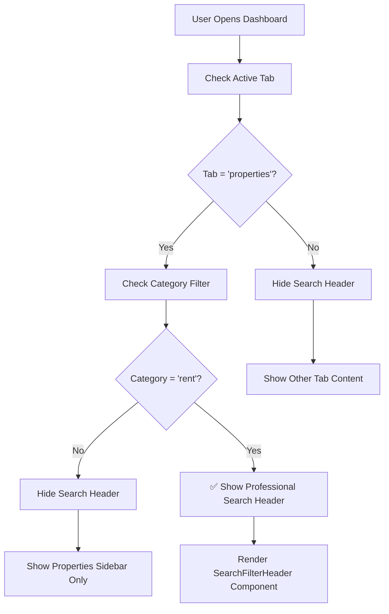
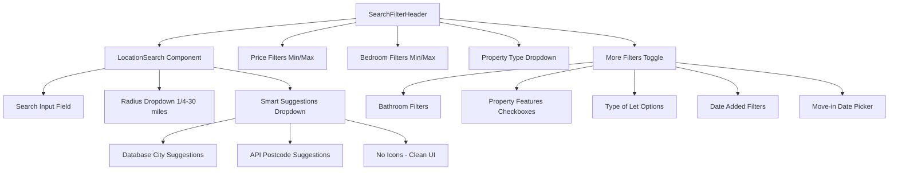
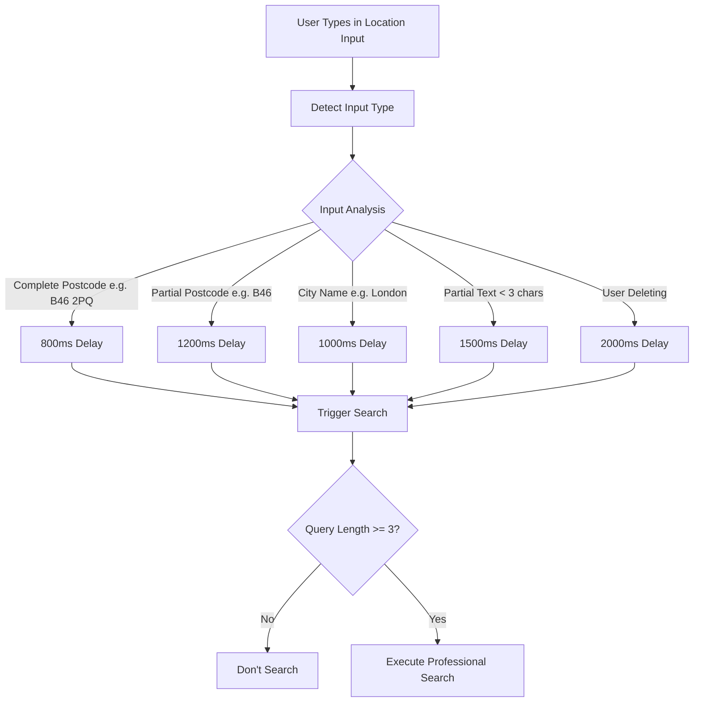
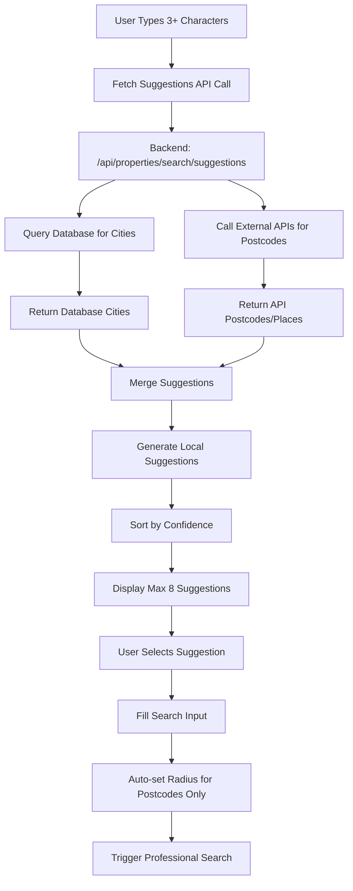
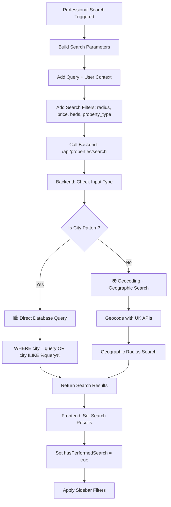
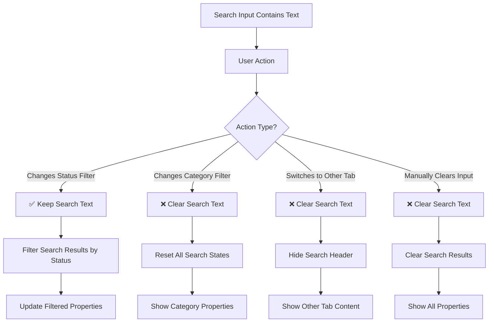
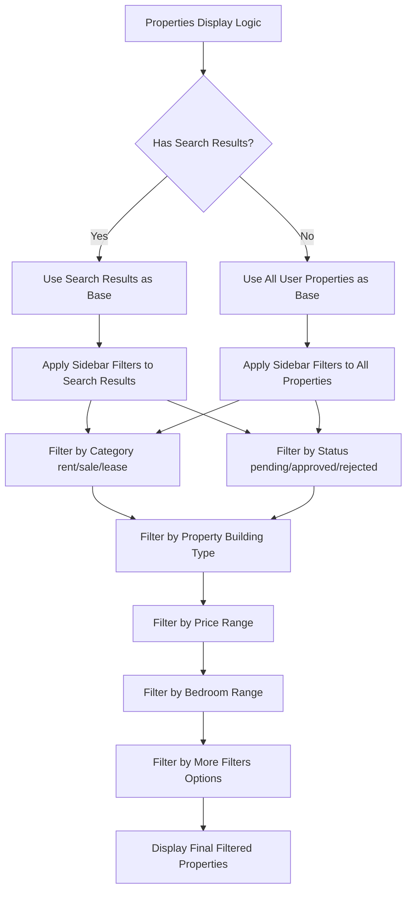
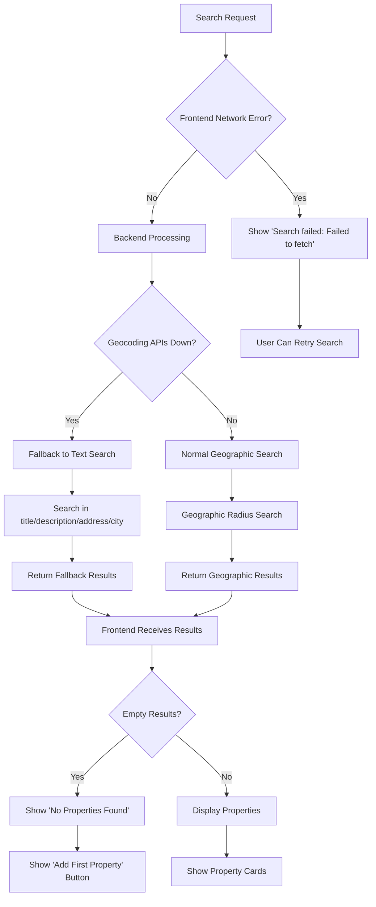
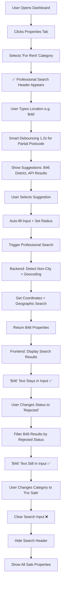

# Professional Search Header Functionality - Complete Implementation Flowchart

## Overview
This flowchart documents the current implementation of the professional search header based on code analysis of UserDashboard.js and all related components.

## 1. Search Header Display Logic



## 2. Search Header Components Structure



## 3. Smart Debouncing & Input Analysis



## 4. Location Search & Suggestions Flow



## 5. Professional Search Execution Logic



## 6. Search Input Persistence Logic



## 7. Sidebar Filtering Integration



## 8. Backend Search Strategy Decision Tree

```mermaid
flowchart TD
    A[Backend Receives Search Request] --> B[Parse Query Parameters]
    B --> C[Extract: q, radius, user_id, show_all_statuses]
    
    C --> D{Has Query + Radius?}
    D -->|No| E[Return All User Properties]
    D -->|Yes| F[Analyze Input with isCityPattern]
    
    F --> G{Is City?}
    G -->|Yes| H[🏙️ City Strategy - No Geocoding]
    G -->|No| I[🌍 Geographic Strategy - With Geocoding]
    
    H --> J[Direct Database Query]
    J --> K[WHERE LOWER(city) = LOWER(query)]
    K --> L[Include ALL Statuses]
    
    I --> M[Geocode with Multiple APIs]
    M --> N{Geocoding Success?}
    N -->|Yes| O[Geographic Radius Search]
    N -->|No| P[Fallback Text Search]
    
    O --> Q[Calculate Distance Formula]
    Q --> R[WHERE distance <= radius_miles]
    
    P --> S[Multi-field Text Search]
    S --> T[WHERE title/description/address ILIKE %query%]
    
    L --> U[Apply Additional Filters]
    R --> U
    T --> U
    
    U --> V[Category/Type/Price/Bedroom Filters]
    V --> W[Return Results to Frontend]
```

## 9. Error Handling & Fallback Strategy



## 10. Complete User Journey Flow



## Key Features Summary

### ✅ Professional Search Header Features:
- **Conditional Display**: Only for "For Rent" category
- **Smart Debouncing**: Different delays based on input type
- **Input Persistence**: Keeps text for status changes, clears for category changes
- **Clean Suggestions**: Database cities + API postcodes, no icons
- **Dual Search Strategy**: Direct DB for cities, geocoding for postcodes/addresses
- **Comprehensive Filtering**: Price, bedrooms, property types, more filters
- **Status Integration**: Works on both search results and regular properties
- **Error Handling**: Graceful fallbacks for API failures
- **User-Friendly**: Loading states, empty states, retry options

### 🎯 Search Strategies:
1. **City Search**: Direct database query (no geocoding)
2. **Postcode Search**: UK Postcodes API + geographic radius
3. **Address/Street Search**: Enhanced geocoding + geographic radius
4. **Fallback Search**: Multi-field text search when geocoding fails

This implementation provides a professional, performant search experience similar to major property websites while maintaining clean code separation and robust error handling. 